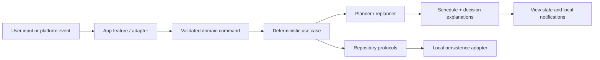

# Architecture

## Status and target

The current source implements Phases 1 through 9 while preserving the Phase 0
boundaries. Phase 2 provides a deterministic seven-day `SchedulingEngine` and
same-day `ReplanningEngine`; schedule-affecting structured commands and
execution actions use that engine through `ScheduleReplanning`. Speech and
local notifications remain permission-backed Apple adapters. Phase 5 adds
local planning-input management, reviewed batch shift parsing, and persisted
manual occurrence overrides. Phase 6 adds approximate meal coverage,
inventory projection, and shopping proposals without adding a calendar, AI
provider, or clinical nutrition dependency. Phase 7 promotes the approved
workout projection into exact program/session prescriptions, occurrence-level
exercise selections, and durable set/rest execution state without adding a
medical decision system. Phase 8 adds permission-aware EventKit, HealthKit
sleep, App Intents, and iCal adapters. Phase 9 implements the optional
strict-schema AI boundary, on-device Vision rota extraction, validated local
backups, privacy/deletion controls, time-change handling, serialized
notification reconciliation, and beta fixtures without granting any external
service scheduling or storage authority.

- UI platform: native SwiftUI iPhone app.
- Provisional minimum deployment target: iOS 17.0, chosen to keep the Phase 1 SwiftData adapter straightforward.
- Package manifest: Swift tools 5.9 syntax for broad Xcode 15+ compatibility.
- Dependency policy: Apple frameworks and the Swift standard library first; no third-party dependency or backend. SwiftData is used only by the Phase 1 app adapter.
- Toolchain note: the current Windows environment has neither Swift nor Xcode. The project must be compiled on a macOS host with a supported stable Xcode before the target or language mode is treated as validated.

The deployment target is a documented decision, not a permanent constraint. Lowering it requires selecting a different persistence adapter or adding availability fallbacks before changing the target.

## Module boundaries

```text
PersonalMissionControl (SwiftUI app target)
  Composition root, navigation, feature views, view state
       |
       v
MissionControlCore (local pure-Swift package)
  Domain values, use cases, validation, deterministic scheduler/replanner,
  integration protocols, structured mutations, decision explanations
       ^
       |
Adapters (owned by the app project and introduced by their feature phase)
  SwiftData | EventKit | HealthKit | Speech | UserNotifications
  AppIntents | iCal | secure storage | optional AI/OCR
```

`MissionControlCore` may use the Swift standard library and carefully selected Foundation value types. It must not import UI, persistence, health, calendar, speech, notification, intent, or network frameworks. The app target owns concrete adapters and dependency composition.

Current package organization:

```text
Sources/MissionControlCore/
  Domain/          Entities, value types, identifiers, recurrence, time windows
  Scheduling/      Constraint stages, placement, replanning, explanations
  Commands/        Confirmed transcripts, intents, proposed mutations
  Execution/       Deterministic execution, history, and notification policies
  Ports/           Repository and platform service protocols
  Seed/            Editable local baseline inputs
```

Feature UI remains grouped by user outcome in the app target, for example Home, Goals, Lists, Plan, VoiceReview, Workout, and Settings.

## Data flow



For voice, transcription is first shown to the user. Send creates a `ConfirmedCommand` envelope. A rule-based or optional AI interpreter returns proposed typed mutations, confidence, range, and warnings. Deterministic validation evaluates those mutations. Only a confirmed, valid mutation writes through repository protocols and requests replanning.

## Domain ownership

Core domain types own semantics and invariants. Persistence and framework models only translate at adapter boundaries.

Primary aggregates/value groups:

- profile/preferences and planning policy;
- goals, projects, missions, routines, checklists, and household work;
- fixed commitments, schedule blocks, external calendar metadata, and decisions;
- completions, actual timing, check-ins, notification state, and weekly consistency;
- nutrition targets, meal plans, shopping, and inventory;
- workout programs, session templates, prescriptions, logs, recovery, and pain flags;
- confirmed language commands, intents, extracted entities, mutations, and confirmations.

Identifiers are stable value types. Dates are stored as absolute instants where appropriate; local-day and recurring rules carry an explicit calendar/time-zone context. Imported external identifiers and modification metadata remain separate from user-owned fields.

## Core protocols

Protocol names may evolve during implementation, but responsibilities must remain separated:

- `SchedulePlanning`: build a seven-day plan from a snapshot and policy.
- `ScheduleReplanning`: replan only an affected future range while preserving history and stable work.
- `ScheduleRepository`: load/save versioned plans, blocks, and decisions.
- `DomainRepository`: focused repositories for missions, goals/projects, routines, completions, nutrition, inventory, workouts, and recovery.
- `CalendarProviding`: permission-aware fixed/external event snapshots and later write-back metadata.
- `HealthContextProviding`: a minimal, permission-aware recovery snapshot rather than raw HealthKit history.
- `SpeechTranscriptionService`: ephemeral recording-to-transcript behavior with availability and cancellation.
- `NotificationService`: permission-aware actionable local notification requests, response routing, and reconciliation.
- `CommandInterpreting`: confirmed text to proposed structured mutations; no write authority.
- `SecretStoring`: Keychain-backed credentials for optional providers.
- `Clock`, `CalendarProvidingContext`, and `IdentifierGenerating`: deterministic test seams.

Protocol request/response values live in the core. Apple types are converted inside adapters and do not leak across the boundary.

## Deterministic scheduler

The scheduler is a staged constraint solver, not a single weighted score:

1. Normalize the horizon, availability, time zone, and immutable history.
2. Validate and reserve hard constraints: fixed/external events, sleep floor, dependencies, travel, preparation, and blocked physical loads.
3. Establish essential coverage: transitions, meals, protected recurrence, and due-window obligations.
4. Rank remaining candidates using ordered soft factors and explicit tie-breakers.
5. Place candidates only in valid intervals and on the configured grid.
6. Preserve breathing room unless a documented priority justifies consuming it.
7. Compare a replan with the current plan and minimize movement of unaffected blocks.
8. Emit `SchedulingDecision` values for placements, moves, omissions, conflicts, warnings, and confirmation requirements.

Replanning accepts an immutable snapshot of completed/in-progress history plus the current future plan. A stability cost is a tie-breaker after correctness, not permission to retain an invalid plan.

The engine is synchronous and side-effect free at its core. Repositories, framework APIs, and long-running interpretation run outside it. This makes the same input snapshot produce the same plan and explanations.

Execution state is occurrence-aware. A reusable mission, such as an approved
workout template, may own several schedule blocks, so starts, completions,
lateness, and notifications use `scheduleBlockID` as the occurrence identity.
The mission identifier continues to identify the reusable work definition.
Schema-4 start records without a block identifier remain readable and use a
deterministic nearest-block fallback during replanning.

### Phase 2 operational assumptions and explicit conflicts

- The product contract specifies sleep targets but not an authoritative
  bedtime. The seed therefore derives sleep from an editable 07:30 preferred
  wake time and a 7.5-hour target. Both are configuration, not inferred facts.
- Exact fixed and externally managed events are never snapped or moved. If two
  overlap, both remain exact and a blocking `fixedOverlap` conflict is emitted.
- Preparation, travel, and shower/change ranges use their configured maximum
  during planning so the plan does not rely on the optimistic edge of a range.
- The five-minute shopping travel seed is treated as each leg around a
  groceries mission, matching the other round-trip transition defaults. It
  remains editable and is not treated as measured travel time.
- A fixed football event only activates the 24-hour heavy lower-body
  restriction when `isFootballMatch` is explicitly set; category alone is not
  treated as proof of a match.
- A routine without a monthly anchor remains readable for migration. The
  engine uses the first horizon day and emits `recurrenceAnchorMissing` until
  the user supplies an anchor.
- Multi-day daily cadences use their editable routine anchor. Legacy routines
  without one retain the fixed local-calendar epoch fallback so a rolling
  seven-day horizon does not reset the cadence on each launch.
- `ApprovedWorkout` remains the scheduling projection and links to one
  user-approved active `WorkoutProgram`. Each occurrence stores the exact
  program, session template, executable exercise IDs, pain-blocked exercise
  IDs, and whether a shortened option was explicitly chosen.
- Session rotation follows the saved program order and completed workout logs.
  Missing, inactive, unapproved, or empty linked programs produce an omission
  explanation; the planner never invents a replacement session.
- Exercise prescriptions own ordered sets, exact rep targets or ranges, rest
  duration, optional target load/progression notes, physical load, and body
  areas. Workout logs persist actual weight/reps, current exercise/set, and the
  current rest-timer end instant.
- Heavy lower-body gym work is excluded during the 24 hours before a match,
  the 24-hour post-match recovery window, and football-training days. Upper
  sessions remain eligible when those lower-body rules do not apply, while
  under-six-hour sleep/fatigue continues to use the editable demanding-work
  recovery threshold.
- Active pain flags filter materially affected exercises from an occurrence,
  including frozen future occurrences, without mutating the approved template.
  A flag returns exercises only after an explicit reassessment/clearance record
  with timestamp and note.
- A skipped gym occurrence may offer a shorter subset of the same approved
  session only while the weekly target remains short. Accepting it changes the
  occurrence metadata and duration, never the saved program.
- Explicit recovery dispositions remain authoritative planning inputs:
  later-today and tomorrow choices create bounded due-window overrides, while
  weekly-backlog and drop choices keep the mission out of the generated
  seven-day timeline until a later user decision supersedes them.
- Project weekly targets create deliberate blocks across the horizon. Backlog
  projects receive no automatic exposure, maintained projects retain a lower
  planning stage, and no project is forced into one block every day.
- Routine anchors make monthly and user-relative cadences deterministic.
  Two-to-three-day responsibilities use an explicit flexible cadence plus a
  due window rather than a hidden rigid recurrence.
- Compatible routine IDs and overlap notes are durable user inputs. The planner
  prefers adjacent valid placements and may attach groceries to the end of a
  tagged supermarket shift, while still preventing unexplained overlaps.
- Pending shopping items become stable-ID mini-goals on a generated Groceries
  mission. Completing a grocery mini-goal also marks the shopping-list item
  purchased.
- Manual Day/Week/Month adjustments persist as occurrence-specific locked
  blocks. They retain user authority, participate in conflict reporting, and
  can be returned to automatic planning.
- Meal templates store user-editable approximate calories, protein, prep time,
  substantial-meal status, and optional inventory usage. Planned meals copy
  those estimates so one day can be edited without requiring an exact log.
- `NutritionPlanningCoordinator` derives a daily seven-day coverage projection
  before planning. Editable calorie, protein, and substantial-meal thresholds
  determine whether a gap is clear enough to schedule one practical saved or
  generic eating block. A declined suggestion remains declined for that local
  day until the user restores it or coverage no longer needs it.
- Meal blocks own generated missions so ordinary completion can optionally
  decrement linked exact quantities or meal portions. Completed generated
  nutrition history is retained while future generated missions are replaced.
- Shortage inference is deterministic and approximate. Qualitative low/out
  state or planned usage beyond known stock creates one linked Shopping
  proposal with an explanation and lead time; the existing groceries routine
  may combine it with a tagged supermarket shift.

## Persistence strategy

Phase 1 uses a `MissionControlRepository` boundary in the core, with an in-memory implementation for deterministic tests and a SwiftData implementation in the app target. Domain structs remain persistence-agnostic. The app adapter stores one schema-versioned local snapshot record whose JSON payload is encoded from the typed core snapshot; adapter round-trip tests protect that mapping. This intentionally simple record can be migrated into normalized SwiftData records when editing breadth requires it, without changing core consumers.

Persistence rules:

- local storage is authoritative by default;
- migrations are explicit and tested against representative fixtures;
- the current snapshot schema is version 10; version 9 adds permission-neutral
  Calendar and Health settings, external-source reconciliation metadata, and
  iCal subscriptions; version 10 adds non-secret AI configuration and privacy
  behavior while retaining earlier decoding defaults;
- a load or migration failure puts the app into visible session-only mode and
  disables repository writes, preventing fallback seed data from overwriting
  the unreadable durable record;
- schedule decisions and completions are append-friendly history rather than destructive edits;
- raw voice audio is temporary and excluded from ordinary persistence;
- secrets use Keychain, not SwiftData or configuration files;
- external calendar/health snapshots store only metadata required for behavior;
- user-initiated JSON backup/export and validated replacement restore are
  available; automatic cloud synchronization and multi-device conflict policy
  remain deferred decisions.

## AI boundary

An AI provider is optional. It receives only user-confirmed text plus the smallest relevant domain summary. It returns a typed proposal and explanation, never a schedule or direct database write. Validation, conflict detection, consequence rules, and schedule generation stay deterministic.

Provider configuration must disclose what leaves the device. The default path supports rule-based commands and manual structured editing without an AI account.

Phase 9 uses a user-configured HTTPS JSON adapter. The credential is stored in
the device Keychain and is absent from the snapshot and backup. The request
contains confirmed text, reference date, time zone, no more than six relevant
mission references, and optionally bounded work-shift times. It never contains
raw Health samples, full calendars, recordings, inventory, or unrelated
schedule history. The response uses `mission-control.command.v1`; unexpected
top-level/mutation fields, unknown enums, invalid identifiers, unsafe dates,
oversized responses, non-finite confidence, and excessive collections are
rejected locally. All accepted AI proposals require explicit review and still
pass through `CommandMutationApplicator` and deterministic replanning.
Confirmation proposals carry a privacy-safe deterministic context revision
token; a relevant mission or fixed-schedule change invalidates the prepared
proposal and requires a fresh interpretation.

The optional rota-image path uses PhotosPicker or fileImporter for explicit
user selection, then Vision text recognition on device. Low-confidence lines
are excluded and surfaced as ambiguity. Parsed candidates reuse
`WorkShiftBatchParser`, compare with existing shifts, start unselected, and
write only after confirmation. No Photo Library entitlement, OCR network
service, or image retention is used.

## Apple integrations and availability

- SwiftData requires iOS 17 and is planned as an adapter, not a domain dependency.
- EventKit, HealthKit, Speech, UserNotifications, and App Intents require entitlements, purpose strings, availability checks, and/or user permission before use.
- HealthKit and several notification/intent behaviors require real-device validation.
- Speech availability and authorization can change at runtime; the UI must retain text entry and retry/cancel paths.
- Phase 3 uses `SFSpeechRecognizer` for iOS 17/Xcode 15 compatibility,
  requires on-device recognition when the selected locale supports it, and
  otherwise allows the Apple system speech fallback. It records to in-memory
  audio buffers only and clears the request after transcription or failure.
- Phase 4 uses `UNUserNotificationCenter` behind `NotificationService`.
  Categories and actions register at launch, and stable per-block request
  identifiers allow pending pre-start, start, late-15, and late-30 reminders to
  be replaced or cancelled whenever persisted schedule state changes.
- Phase 8 keeps EventKit behind `CalendarProviding`, HealthKit sleep behind
  `HealthContextProviding`, and iCal fetching behind
  `ICalSubscriptionProviding`. Core values contain no Apple framework types.
- EventKit full access is used only for import-and-sync mode; write-only access
  is available for app-owned event creation. External events are represented
  as exact immutable fixed commitments. Reconciliation keys combine source,
  calendar/subscription identifier, and external UID so refetches update rather
  than duplicate.
- HealthKit requests read authorization only for Sleep Analysis. Raw
  `HKCategorySample` values are merged inside the app adapter; persistence
  receives only the derived asleep duration and sleep window. Absence of data
  is not interpreted as denial, readiness, or diagnosis.
- App Intents call the same `AppModel` mutations and deterministic replanner as
  the UI. The capture intent opens the reviewed capture surface; it does not
  begin recording without the existing in-app interaction.
- iCal refresh is authoritative only for a successfully fetched coverage
  interval. Failed downloads preserve prior items, cancellations remove their
  UID, and absent UIDs delete only matching local imported commitments within
  that coverage.
- New SDK conveniences must be wrapped in availability checks when they exceed the deployment target.
- iCal import should prefer standards-based read-only metadata before provider-specific integration.
- Significant system time/time-zone notifications re-run deterministic
  planning and notification reconciliation. Profile time zone remains fixed
  unless the user explicitly selects follow-system behavior; exact imported
  instants remain unchanged across DST.
- Notification reconciliation is serialized with a pending rerun so edits
  arriving during an adapter call produce a final reconciliation from the
  newest snapshot.

No integration should make planning unavailable when permission is denied.

## Testing strategy

### Core unit tests

Use XCTest with deterministic clocks, calendars, identifiers, and in-memory repositories. Required scheduler/replanner coverage includes:

- fixed events and zero overlap;
- preparation/travel insertion;
- five-minute grid behavior while preserving exact imported times;
- late-start replanning and frozen history;
- protected-skip consequence and confirmation;
- lower-body restriction within 24 hours before a match;
- under-six-hour sleep context;
- injury/body-area blocking;
- approved workout session rotation and weekly target consistency;
- post-match and football-training lower-body restrictions;
- shortened approved-session suggestion boundaries;
- workout set/rest log persistence and previous-performance lookup;
- food-deficit eating-block insertion;
- approximate calorie/protein/substantial-meal deficit detection;
- editable or declined additional-food block behavior;
- inventory shortage shopping proposals and completion decrement;
- no-valid-window food conflicts;
- household due windows and compatible bundling;
- 30-minute focused-project minimum;
- preserved optional free time;
- minimal movement of unaffected blocks;
- immutable external events.

Every nontrivial deterministic rule receives a focused test and, when useful, an end-to-end planning fixture. Failures must expose the decision trace.

### Adapter and UI tests

- Repository contract tests validate round trips and migration behavior.
- Adapter tests use fakes around Apple APIs where possible; permission and entitlement behavior receives device/manual coverage.
- UI tests cover confirmation boundaries, one-tap completion, navigation, voice review, and consequential skip flows after the core vertical slice exists.
- Accessibility tests cover Dynamic Type, VoiceOver labels/actions, color independence, and reduced-motion behavior.
- Phase 9 core tests cover AI minimization/validation/fallback, strict response
  decoding, OCR ambiguity, schema-9 defaults, backup integrity, DST exactness,
  notification replacement, large-history profiling, and a synthetic week.
  SwiftUI accessibility, appearance, and performance still require simulator
  and signed-device validation.

## Security and observability

Use privacy-safe structured diagnostics. Do not log transcripts, health details, calendar titles, schedule contents, or secrets in production logs. Record anonymous rule identifiers and timing when diagnostics are needed. Data retention and deletion controls are product features, not afterthoughts.
