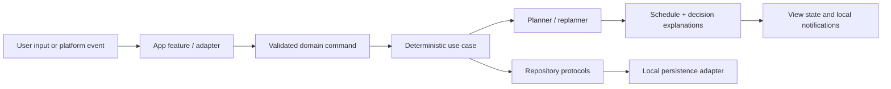

# Architecture

## Status and target

Phase 1 implements the first local vertical slice while preserving the Phase 0 boundaries. It does not implement the scheduling/replanning engine or permission-backed Apple integrations.

- UI platform: native SwiftUI iPhone app.
- Provisional minimum deployment target: iOS 17.0, chosen to keep the Phase 1 SwiftData adapter straightforward.
- Package manifest: Swift tools 5.9 syntax for broad Xcode 15+ compatibility.
- Dependency policy: Apple frameworks and the Swift standard library first; no third-party dependency or backend. SwiftData is used only by the Phase 1 app adapter.
- Toolchain note: the current Windows environment has neither Swift nor Xcode. The project must be compiled on a macOS host with a supported stable Xcode before the target or language mode is treated as validated.

The deployment target is a documented decision, not a permanent constraint. Lowering it requires selecting a different persistence adapter or adding availability fallbacks before changing the target.

## Module boundaries

```text
PersonalMissionControl (SwiftUI app target)
  Composition root, navigation, feature views, view state
       |
       v
MissionControlCore (local pure-Swift package)
  Domain values, use cases, validation, deterministic scheduler/replanner,
  integration protocols, structured mutations, decision explanations
       ^
       |
Adapters (introduced by later phases in the app project)
  SwiftData | EventKit | HealthKit | Speech | UserNotifications
  AppIntents | iCal | secure storage | optional AI/OCR
```

`MissionControlCore` may use the Swift standard library and carefully selected Foundation value types. It must not import UI, persistence, health, calendar, speech, notification, intent, or network frameworks. The app target owns concrete adapters and dependency composition.

Expected later package organization:

```text
Sources/MissionControlCore/
  Domain/          Entities, value types, identifiers, recurrence, time windows
  Scheduling/      Constraint stages, placement, replanning, explanations
  Commands/        Confirmed transcripts, intents, proposed mutations
  UseCases/        Application operations expressed through protocols
  Ports/           Repository and platform service protocols
```

Feature UI remains grouped by user outcome in the app target, for example Home, Goals, Lists, Plan, VoiceReview, Workout, and Settings.

## Data flow



For voice, transcription is first shown to the user. Send creates a `ConfirmedCommand` envelope. A rule-based or optional AI interpreter returns proposed typed mutations, confidence, range, and warnings. Deterministic validation evaluates those mutations. Only a confirmed, valid mutation writes through repository protocols and requests replanning.

## Domain ownership

Core domain types own semantics and invariants. Persistence and framework models only translate at adapter boundaries.

Primary aggregates/value groups:

- profile/preferences and planning policy;
- goals, projects, missions, routines, checklists, and household work;
- fixed commitments, schedule blocks, external calendar metadata, and decisions;
- completions, actual timing, check-ins, notification state, and weekly consistency;
- nutrition targets, meal plans, shopping, and inventory;
- workout programs, session templates, prescriptions, logs, recovery, and pain flags;
- confirmed language commands, intents, extracted entities, mutations, and confirmations.

Identifiers are stable value types. Dates are stored as absolute instants where appropriate; local-day and recurring rules carry an explicit calendar/time-zone context. Imported external identifiers and modification metadata remain separate from user-owned fields.

## Core protocols

Protocol names may evolve during implementation, but responsibilities must remain separated:

- `SchedulePlanning`: build a seven-day plan from a snapshot and policy.
- `ScheduleReplanning`: replan only an affected future range while preserving history and stable work.
- `ScheduleRepository`: load/save versioned plans, blocks, and decisions.
- `DomainRepository`: focused repositories for missions, goals/projects, routines, completions, nutrition, inventory, workouts, and recovery.
- `CalendarProviding`: permission-aware fixed/external event snapshots and later write-back metadata.
- `HealthContextProviding`: a minimal, permission-aware recovery snapshot rather than raw HealthKit history.
- `SpeechTranscribing`: ephemeral recording-to-transcript behavior with availability and cancellation.
- `NotificationScheduling`: local actionable notification requests and reconciliation.
- `CommandInterpreting`: confirmed text to proposed structured mutations; no write authority.
- `SecretStoring`: Keychain-backed credentials for optional providers.
- `Clock`, `CalendarProvidingContext`, and `IdentifierGenerating`: deterministic test seams.

Protocol request/response values live in the core. Apple types are converted inside adapters and do not leak across the boundary.

## Deterministic scheduler

The scheduler is a staged constraint solver, not a single weighted score:

1. Normalize the horizon, availability, time zone, and immutable history.
2. Validate and reserve hard constraints: fixed/external events, sleep floor, dependencies, travel, preparation, and blocked physical loads.
3. Establish essential coverage: transitions, meals, protected recurrence, and due-window obligations.
4. Rank remaining candidates using ordered soft factors and explicit tie-breakers.
5. Place candidates only in valid intervals and on the configured grid.
6. Preserve breathing room unless a documented priority justifies consuming it.
7. Compare a replan with the current plan and minimize movement of unaffected blocks.
8. Emit `SchedulingDecision` values for placements, moves, omissions, conflicts, warnings, and confirmation requirements.

Replanning accepts an immutable snapshot of completed/in-progress history plus the current future plan. A stability cost is a tie-breaker after correctness, not permission to retain an invalid plan.

The engine is synchronous and side-effect free at its core. Repositories, framework APIs, and long-running interpretation run outside it. This makes the same input snapshot produce the same plan and explanations.

## Persistence strategy

Phase 1 uses a `MissionControlRepository` boundary in the core, with an in-memory implementation for deterministic tests and a SwiftData implementation in the app target. Domain structs remain persistence-agnostic. The app adapter stores one schema-versioned local snapshot record whose JSON payload is encoded from the typed core snapshot; adapter round-trip tests protect that mapping. This intentionally simple record can be migrated into normalized SwiftData records when editing breadth requires it, without changing core consumers.

Persistence rules:

- local storage is authoritative by default;
- migrations are explicit and tested against representative fixtures;
- schedule decisions and completions are append-friendly history rather than destructive edits;
- raw voice audio is temporary and excluded from ordinary persistence;
- secrets use Keychain, not SwiftData or configuration files;
- external calendar/health snapshots store only metadata required for behavior;
- exports, cloud synchronization, and multi-device conflict policy are deferred decisions.

## AI boundary

An AI provider is optional. It receives only user-confirmed text plus the smallest relevant domain summary. It returns a typed proposal and explanation, never a schedule or direct database write. Validation, conflict detection, consequence rules, and schedule generation stay deterministic.

Provider configuration must disclose what leaves the device. The default path supports rule-based commands and manual structured editing without an AI account.

## Apple integrations and availability

- SwiftData requires iOS 17 and is planned as an adapter, not a domain dependency.
- EventKit, HealthKit, Speech, UserNotifications, and App Intents require entitlements, purpose strings, availability checks, and/or user permission before use.
- HealthKit and several notification/intent behaviors require real-device validation.
- Speech availability and authorization can change at runtime; the UI must retain text entry and retry/cancel paths.
- New SDK conveniences must be wrapped in availability checks when they exceed the deployment target.
- iCal import should prefer standards-based read-only metadata before provider-specific integration.

No integration should make planning unavailable when permission is denied.

## Testing strategy

### Core unit tests

Use XCTest with deterministic clocks, calendars, identifiers, and in-memory repositories. Required scheduler/replanner coverage includes:

- fixed events and zero overlap;
- preparation/travel insertion;
- five-minute grid behavior while preserving exact imported times;
- late-start replanning and frozen history;
- protected-skip consequence and confirmation;
- lower-body restriction within 24 hours before a match;
- under-six-hour sleep context;
- injury/body-area blocking;
- food-deficit eating-block insertion;
- household due windows and compatible bundling;
- 30-minute focused-project minimum;
- preserved optional free time;
- minimal movement of unaffected blocks;
- immutable external events.

Every nontrivial deterministic rule receives a focused test and, when useful, an end-to-end planning fixture. Failures must expose the decision trace.

### Adapter and UI tests

- Repository contract tests validate round trips and migration behavior.
- Adapter tests use fakes around Apple APIs where possible; permission and entitlement behavior receives device/manual coverage.
- UI tests cover confirmation boundaries, one-tap completion, navigation, voice review, and consequential skip flows after the core vertical slice exists.
- Accessibility tests cover Dynamic Type, VoiceOver labels/actions, color independence, and reduced-motion behavior.

## Security and observability

Use privacy-safe structured diagnostics. Do not log transcripts, health details, calendar titles, schedule contents, or secrets in production logs. Record anonymous rule identifiers and timing when diagnostics are needed. Data retention and deletion controls are product features, not afterthoughts.
