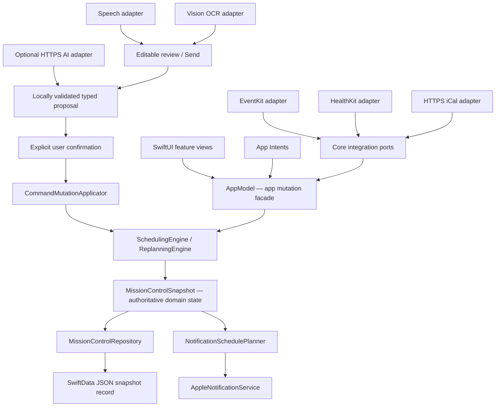

# Phase 1–9 Completion Audit, Integration Verification, and Release-Candidate Stabilization

Audit date: 2026-07-26
Audited branch: `main`
Audited baseline: `ad36eee7e69d084cfbfd067dee5d72abf348aa30`
(`v0.9-pre-verification`) plus the uncommitted stabilization corrections listed
in this report
Host: Windows 10.0.19045, PowerShell 5.1
Verdict: **FAIL — STABILIZATION REQUIRED**
Phase 10 decision: **NO-GO FOR PHASE 10**

## 1. Executive conclusion

Phases 1–9 are broadly implemented in source, but the repository is not a
verified release candidate. No phase can be marked **Verified complete** on the
current Phase 1–9 baseline because the corrected source has not compiled or run
under Swift/Xcode. Phases 8 and 9 also retain mandatory signed-device,
accessibility, performance, provider, and beta-operational acceptance gates.

The audit found a significant integration-history defect: the current Phase
5–9 baseline was created from the older `b311ce3` lineage and did not include
several fixes that had already compiled and passed on
`agent/macos-ci-validation`. Those lost fixes included planner initialization,
Swift type-inference compatibility, notification adapter conformance, work
shift parsing, and related test corrections. The applicable fixes have been
recovered into this working tree and extended for Phase 5–9 behavior, but they
remain uncompiled on the current baseline.

No Phase 10 feature, schema, screen, or integration was started.

## 2. Status summary

| Phase | Audited status | Basis |
| --- | --- | --- |
| 1 — Local vertical slice | **Complete with risks** | Domain, repository, navigation, Home, seed, and execution source exist; current mainline build, simulator launch, and persistence tests are unexecuted. |
| 2 — Deterministic scheduling/replanning | **Complete with risks** | One core planner and replanner exist with extensive tests and explanations; recovered compile fixes and occurrence fixes are not yet executed. |
| 3 — Voice review/commands | **Complete with risks** | Review-before-send and typed proposal pipeline exist; Speech/microphone behavior is not validated on simulator or device. |
| 4 — Notifications/recovery/history | **Complete with risks** | Core lifecycle and adapter source exist; notification adapter corrections and action delivery are not compiled or device-tested. |
| 5 — Goals/projects/lists/routines/shifts | **Complete with risks** | Management flows and deterministic policies exist; later-phase UI journeys have little automated app coverage. |
| 6 — Nutrition/inventory | **Complete with risks** | Domain, settings, coverage/shortage scheduling, and focused tests exist; UI, performance, and device behavior remain unvalidated. |
| 7 — Workouts/recovery | **Complete with risks** | Approved-program execution, logs, timers, and constraints exist; a repeated-occurrence recovery collision was corrected but not executed. |
| 8 — Apple integrations | **Partial** | Concrete adapters and core fakes exist; current EventKit/HealthKit/App Intents code is uncompiled and all signed-device acceptance is open. |
| 9 — Optional AI/OCR/hardening/beta | **Partial** | Optional AI/OCR, backups, privacy controls, and a synthetic-week test exist; mandatory performance, accessibility, provider, signing, TestFlight, and beta gates have not passed. |

## 3. Scope and evidence standard

### 3.1 Source-of-truth inputs

The audit reconciled:

- the original Word prompt pack,
  `Personal_Mission_Control_Codex_Prompt_Pack_v0.1.docx`;
- `docs/PRODUCT_SPEC.md`;
- `docs/ARCHITECTURE.md`;
- `docs/ROADMAP.md`;
- `docs/PHASE_8_DEVICE_VALIDATION.md`;
- `docs/PHASE_9_BETA_VALIDATION.md`;
- existing Phase 1–4 audit records;
- production source, package tests, app tests, Xcode project configuration,
  Info.plist purpose text, and entitlements;
- Git lineage, tags, the open macOS-validation pull request, and its historical
  Actions evidence.

The Word prompt pack was read structurally to recover the original Phase 0–9
intent and cross-phase acceptance requirements. It was not changed.

### 3.2 Status definitions

- **Verified complete**: implemented and all applicable automated, simulator,
  physical-device, integration, and release gates passed on the audited source.
- **Complete with risks**: intended source and meaningful automated coverage
  exist, but one or more verification classes remain unavailable or incomplete.
- **Partial**: meaningful implementation exists, but mandatory acceptance
  criteria remain open.
- **Missing**: no credible implementation of the phase requirement was found.

Authored tests are not treated as passed tests. Historical tests from a
different commit are corroborating evidence only.

### 3.3 Explicit limitations

- The current host has no `swift`, `xcodebuild`, `xcrun`, iOS Simulator, or
  physical iPhone connection.
- No locally corrected Swift source could be compiled.
- No UI was launched or visually inspected at runtime.
- No notification, Speech, Calendar, Health, Siri, Keychain, photo/file,
  provider, signing, or TestFlight operation could be exercised.
- No external state was changed: nothing was committed, pushed, merged,
  deployed, archived, or sent to a third party.

### 3.4 Premature/fake-completion scan

No material production TODO, FIXME, HACK, placeholder marker, fatal error,
empty workflow button, test credential, simulated AI response, or production
mock/fake type was found.

Items classified as intentional:

- `Unavailable*` adapters are explicit denied/unavailable degraded-mode
  implementations used for injection/tests; the shipping app constructs the
  concrete Apple, URLSession, Vision, Keychain, and notification adapters.
- `InMemoryMissionControlRepository` is the core test repository and an
  explicitly disclosed session-only fallback when SwiftData initialization
  fails. The user receives a storage-unavailable notice.
- `MissionControlSeed.makeDemo` is the approved editable first-launch sample
  state. It is not evidence that management flows work, so those flows were
  separately traced and remain simulator/device risks.
- `ContentUnavailableView` usages are genuine empty/unavailable states, not
  navigation placeholders.
- the empty SwiftUI cancel-alert closure delegates dismissal to the system and
  does not represent a missing mutation.

All Goals, Lists, Plan, settings, nutrition, workout, history, voice, and
integration destinations contain functional source paths. Their existence was
not treated as runtime proof.

## 4. Repository and integration lineage

The audited tag and `origin/main` both point to:

```text
ad36eee chore: preserve provisional Phase 9 baseline
```

The separately validated Phase 1–4 line contains:

```text
0be0943 Document Phase 1-4 operational verification
cc0edd2 Handle stale command rejection in app flow
cdaee74 Harden Phase 1-4 operational behavior
07b723d Fix plan compilation and parser conflict fixture
4f836f5 Fix operational parser scheduling and notification defects
a0dabd6 Fix planner initialization for Swift CI
7e098de Fix Swift compiler errors found by CI
```

Pull request
[#1](https://github.com/goldknight1200/personal-mission-control/pull/1)
is still open, draft, unmerged, and not mergeable against its old base. Its
successful Actions run validated `cc0edd2`, not `ad36eee` or the current
working tree. That run reported Xcode 16.4, Swift 6.1.2, 105 passing tests,
three simulator launch profiles, and an unsigned Release build.

Historical performance from that older Phase 1–4 source was:

- 25 typical-week replans: 0.215 seconds;
- 200-item backlog: 8.980 seconds;
- 100 snapshot round trips: 0.470 seconds.

Those numbers are not current Phase 1–9 performance results.

## 5. Concrete architecture map



Architecture findings:

- There is one `SchedulingEngine` and one `ReplanningEngine` in the core
  package; no duplicate scheduler implementation was found.
- `AppModel` is the app-side authority for mutation, persistence, replanning,
  integration refresh, and notification reconciliation.
- `MissionControlSnapshot` schema 10 is the authoritative persisted aggregate.
  SwiftData stores one versioned JSON payload rather than a second parallel
  object graph.
- Apple frameworks remain outside the core package and conform to core ports.
  Core source has no SwiftUI, SwiftData, EventKit, HealthKit, UserNotifications,
  AppIntents, Vision, or PhotosUI imports.
- Speech, AI, and OCR do not directly schedule or persist. They produce reviewed
  typed proposals that flow through local validation, confirmation, mutation,
  and the deterministic scheduler.
- App Intents call shared app/core paths and do not contain a second mutation or
  consequence engine.

## 6. Phase 1–9 completion matrix

| Phase / intended requirement | Implementation and source of truth | Earlier-phase dependency | Automated coverage | Simulator status | Physical-device dependency | Missing behavior / specification deviation | Completion status |
| --- | --- | --- | --- | --- | --- | --- | --- |
| 1 — framework-free model, durable repository, navigation, Home, local seed/execution | Core `Domain`, `MissionControlSnapshot`, repository port; app SwiftData repository, `AppModel`, Root/Home/Execution; spec + architecture | None beyond Phase 0 contract | Domain, repository, seed, SwiftData, execution tests authored | Not run on current source | Persistence lifecycle, accessibility, real launch | No current compile/launch/round-trip result | **Complete with risks** |
| 2 — staged deterministic seven-day scheduler and minimal-change replan | `PlanningPolicy`, `PlanningContracts`, `SchedulingEngine`, `ReplanningEngine`, timeline; architecture scheduling policy | Phase 1 models/repository/Home | Scheduling, replanning, policy, timeline, later synthetic-week tests authored | Not run | Time/clock lifecycle and notification interaction | Recovered/current fixes unexecuted; device performance thresholds unset | **Complete with risks** |
| 3 — reviewed voice/text command proposals; no mutation before Send | Structured command, parser, applicator, Speech port/adapter, voice review UI | Phase 1 mutation/persistence; Phase 2 replan | Parser, applicator, voice-flow tests authored | Microphone/Speech not run | Permission, interruption, audio cleanup, real transcription | No gesture-to-review UI automation or real Speech pass | **Complete with risks** |
| 4 — notifications, missed-start recovery, history/consistency | Notification planner/service, execution, reflection, history UI; snapshot history | Phases 1–3 authoritative state/commands/replan | Notification, execution, reflection, replan, app-flow tests authored | Notification actions not run | Background/terminated actions, permission history, clock/focus modes | Adapter fixes uncompiled; no device delivery evidence | **Complete with risks** |
| 5 — complete goals/projects/lists/routines/shopping/shifts management | Goals/Lists/Plan views, `PhaseFivePlanning`, parser/AppModel mutations; snapshot entities | Phases 1–4 state, scheduler, commands, recovery | Phase 5, parser, mutation, scheduler tests authored | Management/voice UI not run | Batch shift entry and long-form usability | Sparse UI automation; historical display after deletion unverified | **Complete with risks** |
| 6 — approximate nutrition/meal/inventory planning | Nutrition entities/coordinator/settings/AppModel; deterministic scheduler | Phases 1–5 models, lists/shopping, scheduler | Phase 6, scheduling, persistence, beta fixture tests authored | Not run | Input ergonomics and high-volume device performance | No executed UI/inventory/deficit journey | **Complete with risks** |
| 7 — approved workout execution/logs/rest/recovery constraints | Workout entities/planning/views/AppModel; scheduler restrictions | Phases 1–6 scheduler, execution, recovery/nutrition | Phase 7, scheduling, persistence, beta fixture tests authored | Rest timer not run | Timer lifecycle, pain/clearance, real notifications | Occurrence correction unexecuted; no device workout run | **Complete with risks** |
| 8 — optional EventKit, HealthKit, App Intents/Shortcuts, iCal behind ports | Integration ports/entities/reconciler/parser; concrete Apple adapters/intents/settings; Phase 8 device doc | All local state/scheduling/notification foundations | 13 fake-backed Phase 8 tests authored | Apple adapters not compiled/run | Signed EventKit/Health/Siri/Shortcuts/iCal/permissions | Mandatory integration and entitlement acceptance open | **Partial** |
| 9 — optional AI/OCR, backup/privacy/hardening, accessibility/performance/beta | AI pipeline, Phase 9 ports/entities/hardening, HTTPS/Keychain/Vision adapters, settings, beta docs/tests | Every prior phase, especially typed commands and deterministic planner | 17 hardening, one synthetic-week, four performance, persistence tests authored | Not run | Live provider/OCR, accessibility, performance, backup/delete, signing/beta | Mandatory Phase 9 release criteria have not passed | **Partial** |

No primary feature implementation was classified as **Stub or placeholder**.
Executed device/accessibility/performance/beta evidence is **Missing**, and
Phase 9 TestFlight/privacy/support/diagnostic operational artifacts are
incomplete; these are Phase 9 acceptance requirements and drive its
**Partial** status. No material behavior was found **Implemented outside
intended phase**. Later phases extend earlier authoritative services rather
than creating parallel implementations.

## 7. Detailed phase evidence

### Phase 1 — Local vertical slice

Intended requirements:

- framework-free domain model;
- repository boundary plus SwiftData round trip;
- app navigation and editable sample profile;
- Home with Now/Next/Later, subdued transitions, and one-tap execution;
- local launch without account/network.

Implementation evidence:

- `Domain/*`, `MissionControlSnapshot.swift`, `Profile.swift`;
- `Ports/MissionControlRepository.swift`;
- `PersonalMissionControl/Persistence/SwiftDataMissionControlRepository.swift`;
- `App/AppModel.swift`, `App/RootView.swift`;
- `Features/Home/HomeView.swift`, `Features/Execution/ExecutionPromptView.swift`;
- `Seed/MissionControlSeed.swift`.

Automated evidence authored:

- `DomainModelTests`, `RepositoryTests`, `SeedDataTests`;
- `SwiftDataMissionControlRepositoryTests`;
- `ExecutionFlowTests`.

Gaps/deviations:

- current source has not compiled or launched;
- no current empty-store/upgrade/corruption test result;
- no current small/common/large simulator screenshots;
- no current VoiceOver/Dynamic Type runtime pass.

Status: **Complete with risks**.

### Phase 2 — Deterministic scheduling and replanning

Intended requirements:

- staged seven-day planning with hard constraints before soft preferences;
- explainable decisions/conflicts;
- immutable past/in-progress preservation and minimal-change replanning;
- current-day timeline and local late-start update.

Implementation evidence:

- `PlanningPolicy.swift`;
- `Scheduling/PlanningContracts.swift`;
- `Scheduling/SchedulingEngine.swift`;
- `Scheduling/ReplanningEngine.swift`;
- `Scheduling/ScheduleTimeline.swift`;
- `Scheduling/StableIdentifierGenerator.swift`;
- `Features/Plan/PlanView.swift`.

Automated evidence authored:

- 23 `SchedulingEngineTests`;
- 15 `ReplanningEngineTests`;
- `PlanningPolicyTests`, `ScheduleTimelineTests`;
- Phase 5–9 scenario tests that reuse the same engine.

Audit correction:

- recovered planner initialization and cross-toolchain inference fixes;
- retained deterministic candidate-day ordering already present on main;
- changed recovery dispositions from mission-scoped collapse to
  schedule-occurrence scope;
- added simultaneous repeated-workout disposition coverage.

Gaps/deviations:

- no current Swift test run;
- no current deterministic output snapshot across toolchains;
- no current runtime late-start/Home verification;
- performance thresholds are smoke gates, not product-approved service levels.

Status: **Complete with risks**.

### Phase 3 — Voice review and command pipeline

Intended requirements:

- press/hold/release transcription;
- no interpretation or mutation before Send;
- editable Send/Edit/Retry/Cancel review;
- local deterministic parser and typed command contract;
- denial/interruption/retry fallback and ephemeral audio.

Implementation evidence:

- `Commands/StructuredCommand.swift`;
- `Commands/LocalCommandParser.swift`;
- `Commands/CommandMutationApplicator.swift`;
- `Ports/SpeechTranscriptionService.swift`;
- `Features/Voice/VoiceCommandFlowView.swift`;
- Speech adapter in `Platform/ApplePlatformAdapters.swift`.

Automated evidence authored:

- 13 parser tests;
- 8 mutation-applicator tests;
- 7 app voice-flow tests.

Audit correction:

- the work-shift parser now accepts documented whitespace after both `to` and
  hyphen separators;
- a test fixture was corrected so it tests parser behavior rather than an
  accidental seeded fixed-event collision;
- the command revision token now includes every schedule occurrence, closing a
  stale-proposal gap for a moved second occurrence.

Gaps/deviations:

- no current compile/test result;
- microphone authorization, recording interruption, audio cleanup, and real
  Speech transcription are not device-validated;
- no automated SwiftUI UI test drives the full gesture-to-review journey.

Status: **Complete with risks**.

### Phase 4 — Notifications, recovery, history, and consistency

Intended requirements:

- pre-start/start/late notification reconciliation;
- Already Started, Start Now, Replan, and Skip consequences;
- morning change review and passive evening behavior;
- weekly planned-versus-actual summaries;
- cause reassessment for repeated misses.

Implementation evidence:

- `Execution/NotificationSchedulePlanner.swift`;
- `Execution/MissionExecution.swift`;
- `Execution/ReflectionAndConsistency.swift`;
- `Notifications/AppleNotificationService.swift`;
- `Features/Notifications/NotificationSettingsView.swift`;
- `Features/History/HistoryConsistencyView.swift`.

Automated evidence authored:

- notification planner, execution, reflection/consistency, replanning, and app
  execution-flow tests.

Audit correction:

- restored `UNUserNotificationCenterDelegate` conformance;
- safely extracts dates only from supported notification trigger subclasses;
- current main already serializes overlapping notification reconciliation and
  reruns against newest state.

Gaps/deviations:

- adapter correction is uncompiled;
- background/terminated delivery, action routing, permission history, focus
  modes, clock changes, and notification replacement are not device-tested;
- weekly summary wording has unit-level evidence only.

Status: **Complete with risks**.

### Phase 5 — Goals, projects, lists, routines, shopping, and shifts

Intended requirements:

- full goal/project states and overrides;
- Today/shopping/routine management and due windows;
- reviewed natural batch shift entry;
- household recurrence/bundling and maintained-project exposure;
- repeated-skip priority reassessment.

Implementation evidence:

- `Features/Goals/GoalsView.swift`;
- `Features/Lists/ListsView.swift`;
- `Features/Plan/PlanView.swift`;
- `Scheduling/PhaseFivePlanning.swift`;
- goal/project/routine/checklist/fixed-commitment domain entities;
- AppModel create/update/delete/review actions.

Automated evidence authored:

- 8 `PhaseFivePlanningTests`;
- parser and mutation tests;
- broader scheduler/replanner tests.

Gaps/deviations:

- create/edit/delete UI journeys are not covered by app UI automation;
- no current simulator evidence for long lists, batch review, conflicts, or
  keyboard/Dynamic Type layouts;
- deleting entities can intentionally remove their display source while
  historical records retain identifiers; human-readable historical fallback
  should be checked on device.

Status: **Complete with risks**.

### Phase 6 — Nutrition and inventory

Intended requirements:

- approximate calorie/protein/substantial-meal coverage;
- explainable deficit warning and eating-block suggestion;
- exact and qualitative inventory;
- pre-depletion shopping suggestions and compatible bundling;
- editable targets and thresholds.

Implementation evidence:

- `Domain/NutritionEntities.swift`;
- nutrition/inventory fields in profile and command-support entities;
- `Scheduling/NutritionPlanningCoordinator.swift`;
- scheduling integration and nutrition settings in
  `IntegrationSettingsViews.swift`;
- AppModel management actions.

Automated evidence authored:

- 7 `PhaseSixNutritionTests`;
- scheduling, command, persistence, and synthetic-week coverage.

Audit correction:

- persistence validation now rejects negative/non-finite nutrition, meal,
  inventory, and threshold values before save/restore.

Gaps/deviations:

- no current test execution;
- no UI automation for editing all targets, inventory states, or accepting and
  rejecting shortage suggestions;
- no high-volume device measurement for inventory/meal planning.

Status: **Complete with risks**.

### Phase 7 — Workouts and recovery

Intended requirements:

- approved programs with exact exercises/sets/reps/rest/prior performance;
- active exercise/set/rest timer;
- no invented workout;
- match, post-match, sleep, and pain restrictions;
- explicit logged clearance/reassessment.

Implementation evidence:

- `Domain/WorkoutEntities.swift`;
- `Scheduling/WorkoutPlanning.swift`;
- workout-aware `SchedulingEngine`;
- `Features/Workout/WorkoutViews.swift`;
- AppModel workout execution and pain/recovery actions.

Automated evidence authored:

- 11 `PhaseSevenWorkoutTests`;
- scheduling and synthetic-week workout assertions;
- SwiftData workout-log round trip.

Audit correction:

- simultaneous recovery dispositions for different occurrences of the same
  approved workout no longer overwrite one another;
- completed/partial resolution is matched to `scheduleBlockID`, not merely
  `missionID`.

Gaps/deviations:

- correction is unexecuted;
- no simulator/device rest-timer lifecycle, background notification, rotation,
  or interruption pass;
- no physical-device verification of painful-body-area review and explicit
  clearance history.

Status: **Complete with risks**.

### Phase 8 — Apple platform integrations

Intended requirements:

- protocol-backed optional EventKit, HealthKit, App Intents/Shortcuts, and iCal;
- denied/unavailable fallbacks;
- exact immutable external calendar items;
- minimum Health sleep context;
- safe intent consequences;
- documented capabilities and device gates.

Implementation evidence:

- core integration ports/entities/reconciler/iCalendar parser;
- `Platform/ApplePlatformAdapters.swift`;
- `Platform/MissionControlAppIntents.swift`;
- `Features/Integrations/IntegrationSettingsViews.swift`;
- HealthKit entitlement and Calendar/Health purpose strings;
- `docs/PHASE_8_DEVICE_VALIDATION.md`.

Automated evidence authored:

- 13 `PhaseEightIntegrationTests` using protocol fakes;
- schema-default, external reconciliation, denied access, Health derivation,
  and iCalendar parsing coverage.

Gaps/deviations:

- Apple framework code has not compiled on current main;
- no current EventKit import/export/update/delete permission matrix;
- no signed HealthKit provisioning or allow/deny/empty-data test;
- no Siri/App Shortcut discovery, foreground/background, or voice invocation;
- no live HTTPS/webcal refresh, cancellation, offline, or provider variability;
- no archive/signing validation.

Status: **Partial**.

### Phase 9 — Optional AI/OCR, hardening, privacy, and beta

Intended requirements:

- opt-in, minimal-context, confirmation-only AI;
- reviewed OCR with manual fallback;
- secure credentials and inspectable payload;
- backup/restore/deletion/privacy controls;
- passed performance, migration, accessibility, localization/time-zone,
  offline, failure, signing, TestFlight, and beta gates.

Implementation evidence:

- `Commands/AICommandPipeline.swift`;
- Phase 9 domain and service ports;
- HTTPS/Keychain/Vision adapters in `ApplePlatformAdapters.swift`;
- AI/OCR/backup/privacy UI in `IntegrationSettingsViews.swift`;
- `Integrations/PhaseNineHardening.swift`;
- `PhaseNineBetaAcceptanceTests`;
- `docs/PHASE_9_BETA_VALIDATION.md`.

Automated evidence authored:

- 17 hardening tests;
- one full synthetic-week beta fixture;
- four operational performance smoke tests;
- persistence corruption/migration tests.

Audit corrections:

- expanded snapshot validation across planning policy, nutrition, missions,
  routines, history, meals, inventory, workouts, recovery, metadata, and
  nested/top-level identifier collections;
- corrupted semantic payloads are rejected without overwrite;
- stale AI context now includes every schedule occurrence;
- restored repeatable typical-week, 200/500-backlog, and 100-round-trip gates;
- restored a macOS Xcode 16.4 CI workflow for core, simulator, Debug, and
  Release gates.

Gaps/deviations:

- none of the new/current tests or CI has run;
- no configured live provider contract/failure/privacy inspection;
- no real OCR photo/file selection or low-quality image matrix;
- no current backup/delete/reinstall rehearsal;
- no full Dynamic Type, VoiceOver, contrast, Reduce Motion, localization/text
  expansion, or time-zone travel matrix;
- English-only UI remains a known limitation;
- no current supported-device performance or memory measurements;
- signing, privacy metadata, TestFlight material, support/privacy URLs,
  diagnostics policy, and beta-human acceptance remain open.

Status: **Partial**.

## 8. Cross-phase end-to-end verification

| Journey | Source/test path | Current result |
| --- | --- | --- |
| Fresh seed → deterministic plan → Home Now/Next/Later | Seed, scheduler, timeline, Home; seed/scheduling/timeline tests | Source traced; tests authored; current execution blocked. |
| Create goal/project → schedule exposure → skip reassessment | GoalsView/AppModel → PhaseFivePlanning → scheduler | Source traced; core tests authored; UI journey not executed. |
| Enter batch shifts → review → fixed immutable blocks | Voice/text review → parser → mutation → replanner | Source traced; whitespace regression corrected; unexecuted. |
| Voice gesture → transcript review → Send → confirmation → plan | VoiceCommandFlowView → parser → applicator → replanner | Source traced; no simulator/device microphone run. |
| Late/missed mission → action → minimal replan → notification replacement | execution/notification/replanning stack | Source traced; adapter correction uncompiled; device run open. |
| Plan meals/inventory → deficit/shortage → eating/shopping blocks | nutrition coordinator → scheduler | Core tests and synthetic-week assertions authored; unexecuted. |
| Approved workout → execute sets/rest → log → recovery-aware next plan | workout views/domain/planner | Core/app tests authored; occurrence fix unexecuted; timer device run open. |
| Calendar allow/deny → import/update/delete → immutable schedule | EventKit adapter → reconciler → planner | Fake tests authored; Apple integration/device execution open. |
| Health allow/deny/empty → derived recovery context → plan | HealthKit adapter → recovery context → planner | Fake tests authored; signed-device execution open. |
| App Intent → shared consequence path | MissionControlAppIntents → AppModel/core | Static path traced; Siri/Shortcuts execution open. |
| AI/OCR proposal → inspect/review → reject/confirm → deterministic replan | provider/Vision → local validator → confirmation → applicator | Core tests authored; live provider/OCR/device execution open. |
| Backup → reset → restore → notification/integration reconciliation | backup service → repository → AppModel | Unit paths authored; reinstall/device rehearsal open. |
| DST/time-zone change → exact external events → replan/reschedule | lifecycle handling → scheduler → notifications | DST test authored; travel/device notification execution open. |
| Full synthetic week with successive disruptions | `PhaseNineBetaAcceptanceTests` | Comprehensive test authored; not run on current source. |

No cross-phase route was found that allows AI, OCR, Speech, Calendar, Health, or
App Intents to bypass local validation and the deterministic scheduler.

## 9. Build and test results

### 9.1 Current working tree

All required commands were attempted from the repository root.

| Gate | Exact command | Result |
| --- | --- | --- |
| Core package | `swift test --package-path Packages/MissionControlCore` | **BLOCKED**, exit 1: `swift` is not recognized on this Windows host. |
| iOS simulator tests | `xcodebuild -project PersonalMissionControl.xcodeproj -scheme PersonalMissionControl -destination "platform=iOS Simulator,name=iPhone 16 Pro" CODE_SIGNING_ALLOWED=NO test` | **BLOCKED**, exit 1: `xcodebuild` is not recognized. |
| Debug simulator build | `xcodebuild -project PersonalMissionControl.xcodeproj -scheme PersonalMissionControl -configuration Debug -destination "generic/platform=iOS Simulator" CODE_SIGNING_ALLOWED=NO build` | **BLOCKED**, exit 1: `xcodebuild` is not recognized. |
| Release simulator build | `xcodebuild -project PersonalMissionControl.xcodeproj -scheme PersonalMissionControl -configuration Release -destination "generic/platform=iOS Simulator" CODE_SIGNING_ALLOWED=NO build` | **BLOCKED**, exit 1: `xcodebuild` is not recognized. |

No failing XCTest result was produced because no test runner started.

### 9.2 Authored automated coverage

Static inventory:

- core package: **150** XCTest methods in 19 test files;
- app target: **21** XCTest methods in 3 test files;
- total: **171** authored XCTest methods;
- skipped/disabled XCTest APIs: none found;
- third-party Swift package dependencies: none.

High-concentration suites include 23 scheduling, 17 Phase 9 hardening,
15 replanning, 13 Phase 8 integration, 13 local parser, 11 Phase 7 workout,
8 Phase 5 planning, 7 Phase 6 nutrition, and one synthetic-week acceptance
test.

### 9.3 Static validation

Passed:

- `git diff --check`;
- conflict-marker scan;
- changed-Swift-file delimiter-balance heuristic;
- production TODO/FIXME/HACK/placeholder/fatal-error scan;
- production `print`/`debugPrint`/`NSLog` scan;
- core Apple-framework import boundary scan;
- generated-output tracking scan;
- Xcode project source membership and shared-scheme inspection;
- package dependency inspection;
- likely hard-coded credential inspection.

Static checks do not replace Swift compilation, tests, runtime authorization,
or UI/device validation.

## 10. Persistence and migration audit

Findings:

- current snapshot schema is 10;
- decoder defaults cover later collections/settings for legacy payloads;
- repository rejects a future schema;
- Phase 1-style and schema-9 payload migrations have authored tests;
- save, load, backup export, and restore call the integrity validator;
- SwiftData record and payload schema versions must agree before migration;
- the audit expanded semantic validation beyond schema/time-zone/top-level
  intervals and identifiers;
- a new app test verifies semantically corrupted persisted JSON is rejected
  without being silently overwritten.

Open risks:

- migrations have not run on current main under SwiftData/Xcode;
- a current-shaped payload is exercised for every stored schema version, but
  that matrix is unexecuted and does not replace real archived payloads from
  each released schema;
- no real install-over-upgrade or backup-from-old-build rehearsal exists;
- destructive deletion and reinstall behavior can vary with Keychain/signing;
- deleted goals/projects/missions may leave identifier-only historical records;
  the user-visible fallback needs verification.

## 11. Performance and stability audit

Current measurable result: **not measured**.

The working tree now includes repeatable smoke gates for:

- 25 successive typical-week replans;
- 200- and 500-mission backlogs with uniqueness and overlap assertions;
- 100 encode/decode snapshot round trips;
- deterministic profiling of 10,000 completion records.

These tests use generous 30-second guardrails and are intended to catch
catastrophic regressions. They are not sufficient to approve product
performance. The Phase 9 device plan still requires cold load, plan/replan,
Day/Week/Month, history, backup, and notification measurements with at least
10,000 completions, 5,000 workout sets, 1,000 commands, and 1,000 external
items, including peak memory and a recorded threshold decision.

## 12. Security and privacy audit

Positive evidence:

- no likely committed API key, bearer credential, password, or secret was
  found;
- the provider endpoint is user-configured HTTPS;
- URL credentials/query strings are rejected and redirects are not followed;
- bearer credentials are designed for device-only Keychain storage;
- AI is optional, receives minimized reviewed context, and has no persistence
  or scheduling authority;
- raw Health samples, audio, selected OCR images, and Keychain credentials are
  excluded from the snapshot backup contract;
- production logging calls that would emit transcripts, calendar titles,
  Health details, OCR text, schedule content, or credentials were not found;
- photo/file access uses explicit item selection rather than broad library
  permission;
- Calendar, Health, Speech, microphone, and notification purpose/capability
  configuration is present and integration behavior has unavailable fallbacks.

Open release risks:

- purpose text and privacy disclosures have not been reviewed against a real
  configured provider/account;
- Keychain persistence across reinstall/reset is not rehearsed;
- no live network interception confirms payload minimization;
- notification previews may expose mission titles according to OS/user
  settings and need device review;
- privacy nutrition labels, support/privacy URLs, retention policy, export
  compliance, and diagnostics/crash process are not release-ready.

## 13. Accessibility and design-fidelity audit

Static evidence:

- Home retains the specified top-right menu, progress orb, current mission,
  mini-goals, upcoming timeline, bottom navigation, and central microphone;
- Now/Next/Later information remains present and transition/travel content is
  visually subdued;
- scaled metrics exist for prominent Home/microphone elements;
- Reduce Motion is consulted by menu, progress, and microphone animation;
- symbol-only controls inspected have labels or labeled button content;
- category meaning uses title/icon as well as adaptive color;
- semantic backgrounds/materials and scrollable content are used.

Not verified:

- all Dynamic Type and accessibility sizes;
- VoiceOver order, values, custom actions, modal focus, and error announcements;
- light/dark/increased-contrast ratios;
- Reduce Motion for every transition;
- long English text/provider errors and localization expansion;
- small/common/large iPhone layout;
- landscape, keyboard, interruption, and reachability behavior.

Therefore design fidelity is plausible in source but not release-verified.

## 14. Defects found and corrections

| ID | Severity | Finding | Correction/status |
| --- | --- | --- | --- |
| AUD-01 | High | Current Phase 5–9 baseline omitted previously compiled planner initialization fixes. | Recovered local-initialization ordering in `SchedulingEngine`; **corrected, uncompiled**. |
| AUD-02 | High | Replanning expressions relied on Swift inference forms previously rejected by the CI toolchain. | Added explicit result/set types and decomposed replacement selection; **corrected, uncompiled**. |
| AUD-03 | High | `AppleNotificationService` lacked delegate conformance and called a trigger API unavailable on the abstract base type. | Restored conformance and concrete trigger extraction; **corrected, uncompiled**. |
| AUD-04 | High | Main-actor default construction in `AppModel` had a known compile-isolation problem. | Made the injectable notification service optional and constructs the fallback inside the initializer; **corrected, uncompiled**. |
| AUD-05 | Medium | Work-shift input with whitespace after `to`/`-` could fail despite being a documented form. | Regex accepts optional whitespace; regression fixture corrected; **corrected, unexecuted**. |
| AUD-06 | High | Simultaneous unresolved occurrences of the same approved workout collapsed by mission identifier. | Dispositions/resolution/recovery windows now use schedule-block occurrence identity; regression test added; **corrected, unexecuted**. |
| AUD-07 | High | Snapshot validation accepted many semantically invalid values, nested duplicate IDs, orphaned active references, and record/payload schema disagreement could bypass migration. | Expanded validator, enforced schema agreement, and added core/app corruption/migration tests; **corrected, unexecuted**. |
| AUD-08 | Medium | Command revision tokens represented only the first block for a repeated mission, allowing a stale second-occurrence proposal. | Revision material now includes all schedule blocks; regression test added; **corrected, unexecuted**. |
| AUD-09 | Medium | Deletion cascades could retain active workout or meal-template references to removed entities. | Mission cascades remove active workout projections; template deletion clears active meal/nutrition references while retaining history; regression tests added; **corrected, unexecuted**. |
| AUD-10 | High | `main` had no CI workflow and no status checks on `ad36eee`. | Restored macOS core/simulator/Debug/Release workflow; **authored, not run or pushed**. |
| AUD-11 | Medium | Roadmap wording said “complete in source” while mandatory current verification remained open. | Roadmap status wording is aligned to this audit; audit remains authoritative. |
| AUD-12 | Release blocker | Current Phase 1–9 source has no macOS/Xcode compile or XCTest result. | **Open**; run the restored workflow or exact local commands on macOS. |
| AUD-13 | Release blocker | Phase 8 signed-device and Phase 9 accessibility/performance/provider/beta gates are open. | **Open**; execute the physical-device checklist and release gates. |
| AUD-14 | Medium | Phase 5–9 feature UI journeys have little/no automated UI coverage. | **Open risk**; add focused XCUITest coverage after baseline compile is green. |

## 15. Release risks

### Release blockers

1. The current corrected working tree has never compiled.
2. No current core or app XCTest suite has run.
3. No current Debug launch or Release build exists.
4. EventKit, HealthKit, App Intents, Speech, notifications, Keychain, Vision,
   and file/photo adapters are unverified on supported Apple environments.
5. Required accessibility and supported-device performance matrices are open.
6. Signing, HealthKit provisioning, archive, privacy metadata, TestFlight, and
   beta operational readiness are open.

### High residual risks

- Swift 6/compiler or Apple SDK errors may remain in Phase 5–9 source.
- The recovered and new occurrence/persistence corrections may reveal behavior
  changes when the full suite runs.
- Notification concurrency/action behavior can only be trusted after
  device/runtime exercise.
- Integration permission histories and external mutation reconciliation can
  differ from protocol fakes.

### Medium residual risks

- limited app UI automation for management, nutrition, workout, and integration
  screens;
- English-only UI and untested text expansion;
- the authored every-version current-shaped migration matrix is unexecuted and
  real archived payloads from every historical schema are unavailable;
- historical entities may lose display context after source-entity deletion;
- performance guardrails are broad and device thresholds are unset.

### Product-scope uncertainties

- Goal-to-project decomposition uses missions as the schedulable
  milestone/task unit; there is no separate milestone entity. Product approval
  is needed if milestones require identity or lifecycle beyond missions.
- The source is English-only. Phase 9 requires localization testing, but the
  approved set of release locales is not stated.
- Performance expectations cite approximate historical numbers, but no
  supported-device matrix or formal warning thresholds have been approved.
- Local reset deliberately does not delete provider-owned data or previously
  exported Apple Calendar events. The support/privacy policy must confirm that
  boundary.
- The AI path is a configurable custom JSON contract rather than a
  provider-specific account flow. Confirm that this is the intended beta
  product scope before preparing tester instructions.

## 16. Exact GO/NO-GO decision

**NO-GO FOR PHASE 10.**

Phase 10 may begin only after all of the following are attached to this audit:

1. green `swift test --package-path Packages/MissionControlCore`;
2. green iOS simulator XCTest result on the current commit;
3. green unsigned Debug and Release simulator builds;
4. successful launch and smoke pass on small, common, and large supported
   iPhone simulators;
5. completed physical-device Phase 1–9 checklist with no unresolved
   release-blocker or high-severity defect;
6. signed Calendar/Health/Siri/Speech/notification/Keychain/OCR validation;
7. recorded accessibility and performance results;
8. completed signing/archive, privacy metadata, TestFlight, diagnostics,
   support, and beta-feedback gates;
9. reconciliation of any failures into this report and a final rerun;
10. a new audit verdict of **PASS** or an explicitly accepted
    **PASS WITH RISKS**.

Until then, work is limited to Phase 1–9 stabilization and verification.
